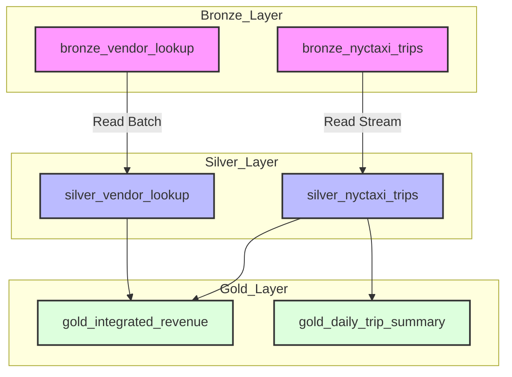

# Azure Databricks Medallion SDP Bundle & CI/CD Guide (Jinja2 Pre-rendered DAB Architecture)

Azure Databricks **빈 깡통(초기) 환경**에서 **Jinja2 템플릿 프리렌더링(Pre-rendering) 기반의 Databricks Asset Bundles (DABs)**, **Medallion Architecture (Bronze / Silver / Gold)**, 그리고 **GitHub Actions CI/CD** 구축 가이드입니다.

---

## 💡 왜 Jinja2 Pre-rendering DAB 인가요?

순수 Databricks YAML(Vanilla DAB)은 파일 단위 include만 지원하여 클러스터 설정, 권한, 스케줄 코드가 여러 파일에 수없이 중복(Boilerplate)되는 한계가 있습니다.

본 프로젝트는 **Jinja2 Pre-rendering 아키텍처**를 도입하여 다음과 같은 이점을 제공합니다:
1. **DRY (Don't Repeat Yourself)**: `bundle/includes/` 내의 공통 클러스터/권한/스케줄 조각을 ``로 완벽 재사용합니다.
2. **동적 환경 분기**: `` 구문으로 개발/운영 환경별 클러스터 크기, 스케줄 활성화 여부를 유연하게 분기합니다.
3. **Clean Output**: 배포 직전 렌더링된 깔끔한 순수 YAML이 `dist_bundle/resources/`에 자동 생성됩니다.

---

## 🏗️ 프로젝트 구조

```text
.
├── bundle/                          # [Jinja2 원본 템플릿] 모듈화된 원본 코드
│   ├── includes/                    # 재사용 가능한 YAML 조각들
│   │   ├── base_permissions.yml.j2  # 권한 및 환경 태그
│   │   ├── cluster_config.yml.j2    # 클러스터 오토스케일링 사양
│   │   └── schedule.yml.j2          # Cron 스케줄 설정
│   ├── pipelines/                   # DLT 파이프라인 템플릿
│   │   └── medallion_pipeline.yml.j2
│   └── workflows/                   # Workflows Job 템플릿
│       └── medallion_workflow.yml.j2
├── dist_bundle/                     # [렌더링 결과물] (GitIgnored, 빌드 시 자동 생성)
│   └── resources/
│       ├── medallion_pipeline.yml
│       └── medallion_workflow.yml
├── scripts/
│   └── render_bundle.py             # Jinja2 프리렌더링 엔진 스크립트
├── src/                             # [Medallion DLT Models] PySpark/DLT 코드
│   └── models/
│       ├── bronze/                  # Bronze (Raw Ingestion)
│       ├── silver/                  # Silver (Cleaned & Expectations)
│       └── gold/                    # Gold (Business Data Marts)
├── Makefile                         # 빌드 및 배포 자동화 명령 모음
├── databricks.yml                   # DAB 메인 매니페스트 (dist_bundle 참조)
├── requirements.txt                 # 파이썬 의존성 (jinja2 등)
└── README.md
```

---

## 🛠️ 개발 및 배포 명령 (Makefile)

### 1. Jinja2 템플릿 렌더링 (Dev / Prod)
```bash
# 개발 환경 렌더링
make render TARGET=dev

# 운영 환경 렌더링
make render TARGET=prod
```

### 2. 번들 유효성 검사 (Validate)
```bash
make validate TARGET=dev
```

### 3. Databricks 배포 (Deploy)
```bash
make deploy TARGET=dev
```

---

## 🔗 단일 DAG 파이프라인 데이터 흐름도



---

## 🚀 GitHub Secrets & CI/CD

GitHub 저장소 **Settings > Secrets and variables > Actions** 등록:
- `DATABRICKS_HOST`: Azure Databricks URL (`https://adb-xxx.azuredatabricks.net`)
- `DATABRICKS_TOKEN`: Databricks Personal Access Token (`dapi...`)

GitHub Actions가 PR 및 Main Push 시 자동으로 `python scripts/render_bundle.py`를 호출하여 렌더링 후 검증 및 배포를 수행합니다.
